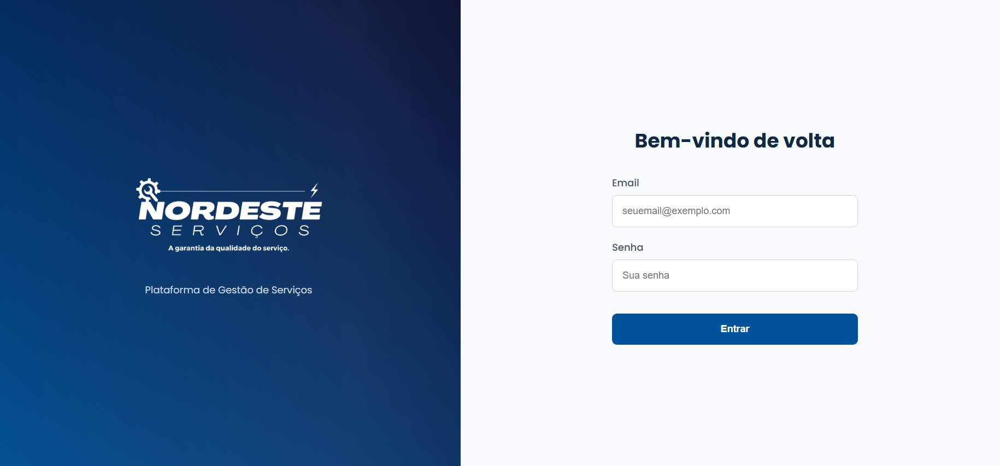
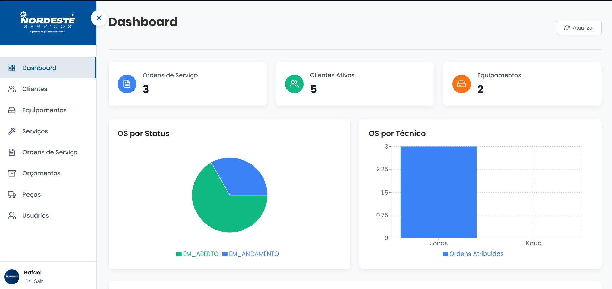

<div align="center">
  
  <h1>Nordeste Serviços</h1>
  <p>Sistema de Gestão de Ordens de Serviço</p>
</div>

---

## 📝 Sobre o Projeto

O **Nordeste Serviços** é um sistema web completo para a gestão de serviços, clientes, equipamentos e orçamentos. A plataforma foi desenvolvida para otimizar o fluxo de trabalho de empresas prestadoras de serviços, centralizando informações e facilitando o gerenciamento de operações diárias.

---

## ✨ Funcionalidades Principais

-   **Dashboard:** Visualização rápida de métricas e status gerais.
-   **Gestão de Clientes:** Cadastro, edição, visualização de detalhes e exclusão de clientes.
-   **Gestão de Equipamentos:** Cadastro de equipamentos associados aos clientes.
-   **Ordens de Serviço (OS):** Criação e acompanhamento de ordens de serviço.
-   **Orçamentos:** Geração de orçamentos a partir de OS ou de forma avulsa.
-   **Gestão de Peças e Materiais:** Controle de inventário de peças utilizadas nos serviços.
-   **Controle de Usuários:** Gerenciamento de usuários do sistema (Administradores, Técnicos).
-   **Perfil de Usuário:** Página de perfil individual para cada usuário.
-   **Autenticação Segura:** Sistema de login com tokens JWT.

---

## 🛠️ Tecnologias Utilizadas

O projeto é uma aplicação full-stack dividida em duas partes principais:

### **Frontend (React)**

-   **Framework/Lib:** [React.js](https://reactjs.org/)
-   **Build Tool:** [Vite](https://vitejs.dev/)
-   **Estilização:** [Styled Components](https://styled-components.com/)
-   **Roteamento:** [React Router DOM](https://reactrouter.com/)
-   **Cliente HTTP:** [Axios](https://axios-http.com/)
-   **Ícones:** [React Icons](https://react-icons.github.io/react-icons/)

### **Backend (Java)**

-   **Framework:** [Spring Boot](https://spring.io/projects/spring-boot)
-   **Linguagem:** Java
-   **Gerenciamento de Dependências:** Maven (baseado na estrutura do projeto)
-   **Banco de Dados:** Spring Data JPA (configurado para H2 em desenvolvimento)
-   **Segurança:** Spring Security
-   **Utilitários:** Lombok

---

## 🚀 Como Executar o Projeto

Siga os passos abaixo para configurar e executar o projeto em seu ambiente local.

### **Pré-requisitos**

-   [Node.js](https://nodejs.org/en/) (versão 18 ou superior)
-   [JDK](https://www.oracle.com/java/technologies/downloads/) (versão 17 ou superior)
-   [Apache Maven](https://maven.apache.org/download.cgi)
-   Um editor de código de sua preferência (ex: VS Code, IntelliJ IDEA).

### **1. Backend (API)**

Primeiro, inicie o servidor da API Java:

```bash
# Navegue até a pasta da API (assumindo que seja a raiz do backend)
cd apiEx

# Instale as dependências com o Maven
mvn clean install

# Execute a aplicação Spring Boot
mvn spring-boot:run
```

O servidor da API estará em execução em `http://localhost:8080`.

### **2. Frontend (React App)**

Em um novo terminal, configure e inicie a aplicação React:

```bash
# Navegue até a raiz do projeto (se não estiver lá)
cd .. 

# Instale as dependências do frontend
npm install

# Crie o arquivo de variáveis de ambiente na raiz do projeto
# (Crie um arquivo chamado .env na raiz do diretório nordeste-servicos-web)
touch .env

# Adicione a URL da sua API ao arquivo .env.
# Se estiver usando ngrok, substitua pelo seu URL.
echo "VITE_API_URL=http://localhost:8080" > .env

# Inicie o servidor de desenvolvimento do Vite
npm run dev
```

A aplicação frontend estará acessível em `http://localhost:5173` (ou outra porta indicada pelo Vite).

---

## 📸 Screenshots

<div align="center">
  
  
</div>

---

<p align="center">Feito com ❤️ por Codagis</p>
